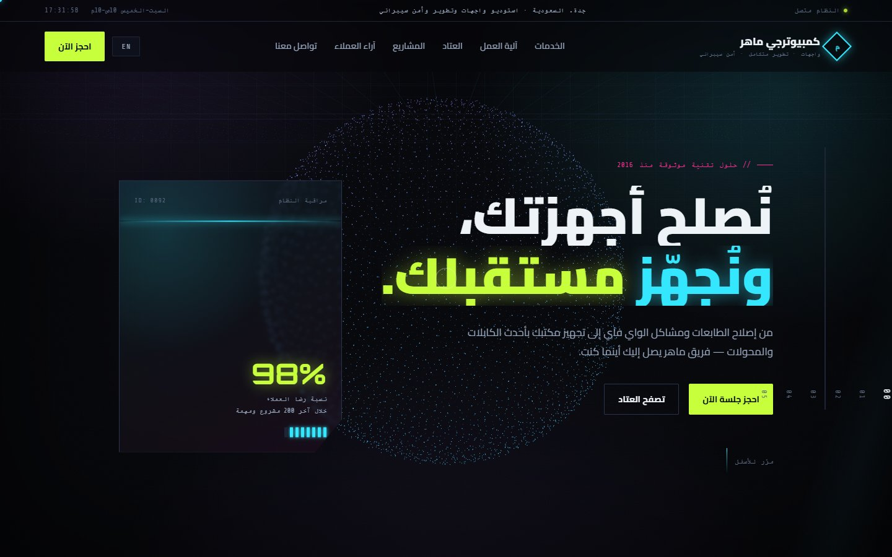
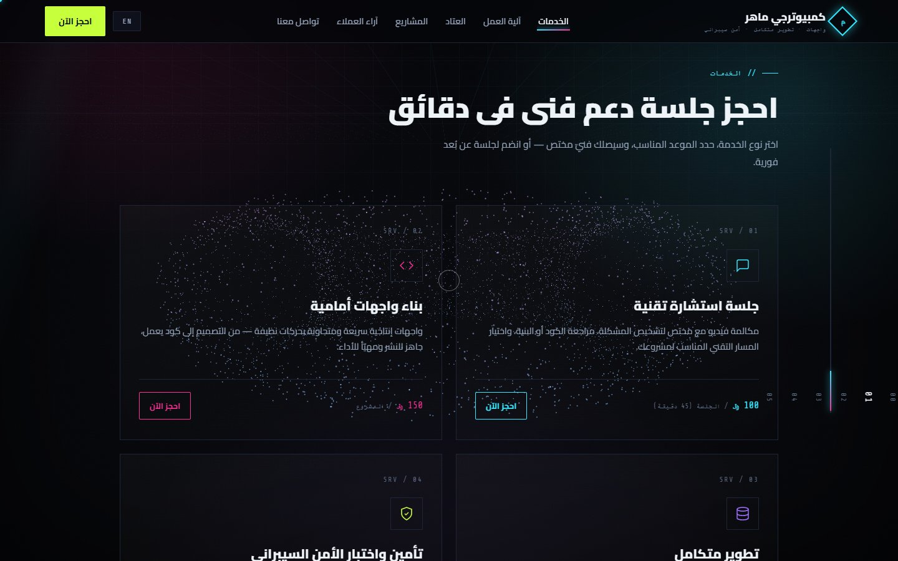
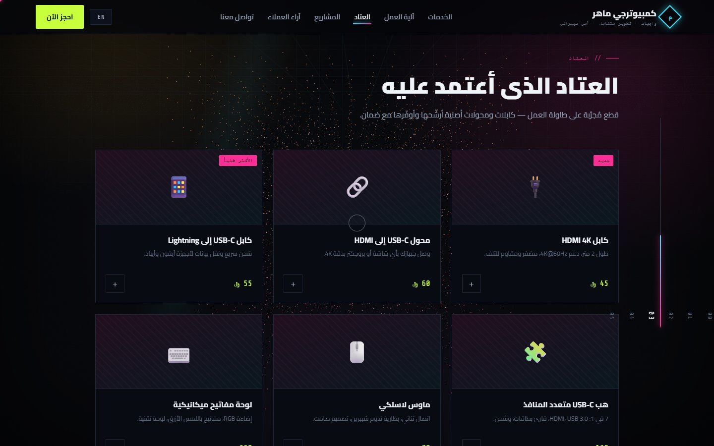
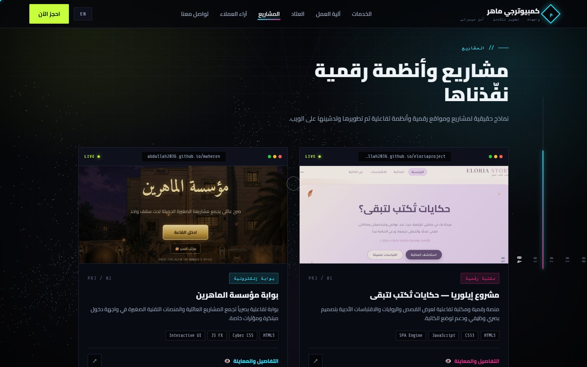

# كمبيوترجي ماهر — Night City (Computerjy Maher v3)

A scroll-driven, neon-Tokyo redesign of the Computerjy Maher / Maher Tech site. The whole page plays as **one continuous cinematic scene**: a WebGL particle field morphs its shape and colour as you move from section to section.

Built as a **separate project** that uses the original
([`abdullah2036/ComputerjyMaher`](https://github.com/abdullah2036/ComputerjyMaher)) purely as reference. The original is untouched.

**Live:** https://abdullah2036.github.io/computerjymaherV3/



## The series

| Version | Idea |
|---|---|
| v1 · [ComputerjyMaher](https://github.com/abdullah2036/ComputerjyMaher) | 2D cyberpunk / retro-terminal landing page |
| v2 · [computerjymaher3d](https://github.com/abdullah2036/computerjymaher3d) | First-person WebGL room, with the monitor as a portal into a 3D showroom |
| **v3 (this repo)** | One continuous scroll-driven scene, camera on rails |
| v4 · [computerjymaherOS](https://github.com/abdullah2036/computerjymaherOS) | The studio as an operating system: a macOS-style desktop or an iOS-style phone |

## What's in it

- **WebGL particle system** that morphs shape *and* colour per section
  (globe → torus → helix → lattice → city skyline → ring), with pointer and
  scroll parallax and additive-blended shader points.
- Perspective neon **street grid**, drifting light beam, scroll-linked hue
  shift, film grain and scanlines.
- **Custom cursor**, magnetic buttons, 3D tilt and cursor-follow glow on every
  card, clip-reveal headings, side progress rail, count-up stats, and a pinned
  "process" line that fills as you scroll it.
- Full `prefers-reduced-motion` path (no smooth scroll, no loops, a static
  particle frame, instant reveals).
- Reveals and counters run on `IntersectionObserver`, so content can never get
  stuck hidden even if a CDN script fails.
- Arabic (RTL) by default with an English toggle; every booking and purchase opens a pre-filled WhatsApp chat.

## Screenshots

| | |
|---|---|
|  |  |



## Stack

Plain HTML/CSS/JS, **no build step**. Three libraries load from CDN:

| lib | why |
|---|---|
| three.js r128 | WebGL particle field |
| GSAP + ScrollTrigger 3.12.5 | scrubbed scroll animation |
| Lenis 1.1.20 | smooth scroll |

## Run locally

Open `index.html` on any static host (GitHub Pages, Cloudflare Workers/Pages, etc.), or locally:

```bash
git clone https://github.com/abdullah2036/computerjymaherV3.git
cd computerjymaherV3
python -m http.server 8000     # then open http://localhost:8000
```

### Dev query params

- `?static` disables Lenis (native scroll). Useful for debugging.
- `?show` forces every reveal/animation to its end state immediately.

## Project structure

```
computerjymaherV3/
├── index.html          sections: hero, services, how, products, projects, reviews, contact
├── styles.css          neon theme, grid, grain/scanlines, card tilt, reduced-motion path
├── script.js           i18n (ar/en), Lenis + ScrollTrigger setup, three.js particle
│                       field and per-section morphs, reveals, counters, WhatsApp booking
└── assets/projects/    screenshots used in the projects section
```

## Content changes vs the original

- **Services** replaced with: consulting `100 SAR`, frontend building
  `150 SAR`, full-stack `300 SAR`, securing & cybersecurity testing `100 SAR`.
- **Products** kept (same items and prices) but reframed as a "bench / kit" shelf.
- **How it works** and two testimonials lightly retuned to match the new
  dev/security services.
- Projects, brand, hero copy, AR/EN + RTL, and every WhatsApp deep link are preserved.

## Known follow-ups

- No mobile nav menu (matches the original: links just hide below 1000px).
- The statement band only drifts one direction after an EN/AR toggle.

---

Built by **Abdullah Bokhary** · [Portfolio](https://abdullah.pageui.workers.dev/) · [LinkedIn](https://www.linkedin.com/in/abdullah-bokhary-840315326/) · [GitHub](https://github.com/abdullah2036)
